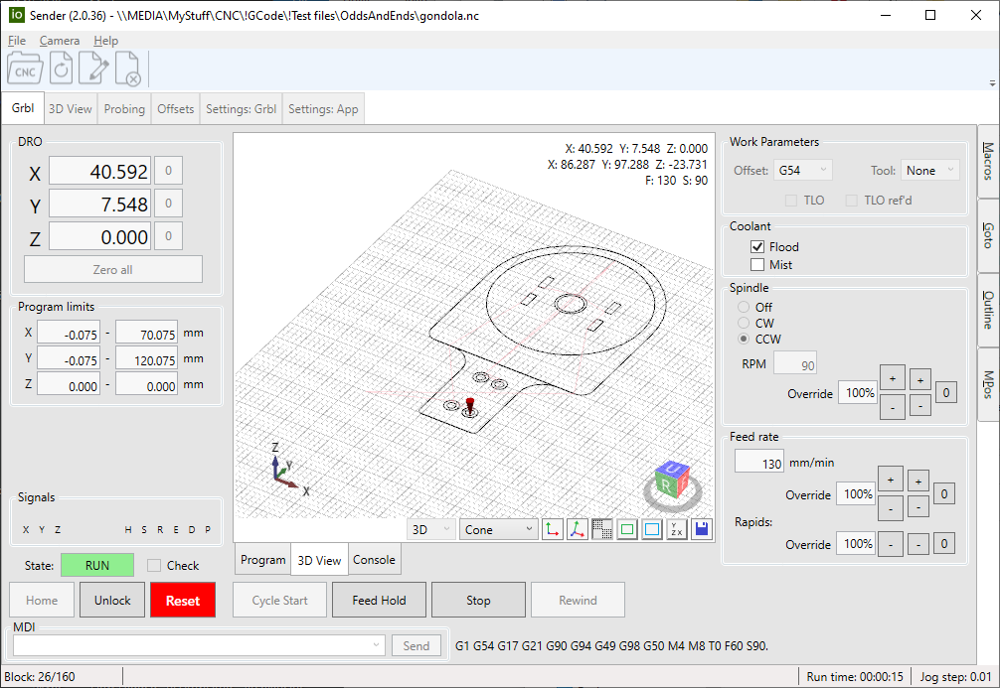

## GRBL GCode Sender

2020-04-17: Alpha 17 release of binary.

Changes:

* Resizable UI.
* Toolbar with file handling tools, display of user defined macros with keyboard shortcuts.
* Status bar for messages, run time and keyboard jog step size \(jogging with \<CTRL\>+cursor keys\).
* Keyboard step jogging made available for non-grblHAL firmware. Change beetwen step sizes on the fly with numeric keypad `4` and `6`. Feed rate is fixed to setting in _Settings: App_ tab. 
* Shortcuts for sidebar flyouts \(use Alt+underscored letter\).
* Cursor key jogging when jog flyout is active, even for non grblHAL firmware. _No_ autorepeat!.
* Change step size and feedrate with keyboard shortcuts when jog flyout is active. Bound to numeric keypad `2`, `4`, `6` and `8`.
* [Manually](https://github.com/terjeio/Grbl-GCode-Sender/wiki/Usage-tips) associate GCode filetypes with sender.

[Spring](https://www.yr.no/place/Norway/Vestland/Alver/Io~105904/long.html?spr=eng) has finally arrived after a long wet and windy period :-), development will continue at a much slower pace from now...

---

2020-04-11: Alpha 15 release of binary.

Added interfaces for GCode conversion \(from other file formats\) and transformation.

Initially I have added two converters that I need for drilling, milling board outlines and making solder paste stencils from [KiCad](https://www.kicad-pcb.org/) PCB designs:

* Excellon to G81 drill commands. Has support for slots (Excellon G85). `.drl` filename extension required. Only for [grblHAL](https://github.com/terjeio/grblHAL) firmware.

* HPGL to edge cuts or solder paste stencil \(when firmware is in laser mode\). `.plt` filename extension required.

Two transformers added \(available from _File>Transform_ menu\):

* Arc to lines. Replaces Arcs \(G2, G3\) and splines \(G5\) with line segments. Arc tolerance from grbl firmware setting.

* Add drag knife moves.

__Note:__ these conversions and transformations has not yet been tested in a machine! Use with care.

Added _File>Save_ menu option for saving converted/transformed GCode.  
__NOTE:__ Only metric output for now. Blocks will be reorganized to comply with NIST ordering. Again, use with care! 

Lathe mode extensions: 3D viewer switched to XZ plane. G33 and G76 rendering implemented.

Added setup option to to enable keyboard jogging when firmware is not grblHAL. [Understand the risks involved](https://github.com/terjeio/Grbl-GCode-Sender/wiki/Known-limitations) before doing so!

Many internal changes - perhaps the most important is a GCode emulator that is used by functions such as 3D rendering and transformations. Some bug fixes.

---

2020-03-29: Alpha 14 release of binary.

Added probing tab with tool length, edge finder, center finder and height map options. __NOTE:__ This has NOT been extensively tested! G20 (inches) mode not tested at all! Do not use unless you understand the risks.

Disabled keyboard jogging when firmware is not grblHAL](https://github.com/terjeio/grblHAL). May add setup option to reenable later.

Many internal changes.

---

2020-03-16: Alpha 13 release of binary.

Program list control has been replaced vith a tab control with easy access to a 3D view and a console (for showing replies from grbl).

Added bounding box calculation for arcs (G2 & G3), _Program limits_ should now be accurate.

---

2020-01-22: First alpha release of binary. Use with care and please report issues!

__NOTE:__ Keyboard jogging with a grbl firmware other than grblHAL is likely to fail, this is a firmware problem so no plan to fix. grblHAL _may_ also occasionally fail \(likely due to issues in the sender\) so be ready to hit reset/estop if it goes wrong!

__NOTE:__ .Net Runtime version 4.5.2 is required, so this sender is for Win7 or later.

Some known issues:

* The 3D-viewer will slow down loading of large files, if this is a problem then disable it in app settings. __Fixed.__

* A restart is required after changing most app settings.

* Lathe mode wizards may generate bad code, needs comprehensive testing. NOTE: As far as I know currently only grblHAL for MSP432 supports G76 for threading, all other builds will generate an error on G76. The G76 code generated is the linuxCNC variant.

* There is no UI yet for configuring streaming via telnet or websocket protocols, either the app config file must be edited or the connection parameter has to be supplied on the command line.

* Program limits displayed does not include arcs correctly if outside the bounding box defined by linear moves. __Fixed.__

---

Please check out the [Wiki](https://github.com/terjeio/Grbl-GCode-Sender/wiki) for further details.

---

A complete rewrite of my [Grbl CNC Controls library](https://github.com/terjeio/Grbl_CNC_Controls) including a sender application on top of these. It supports new features in [GrblHAL](https://github.com/terjeio/grblHAL) such as manual tool change and [external MPG](https://github.com/terjeio/GRBL_MPG_DRO_BoosterPack) control - and is one of the reasons for writing this library and app. Other senders I have tried does not play nice when a MPG pendant is connected directly to the Grbl processor card...

---

Current layout, likely to change. Since using the MVVM coding pattern this is fairly easy to do.

3D view of program, with live update of tool marker.

Advanced grbl configuration with on-screen documentation. UI is dynamically generated from data in a file.

---
2020-03-16
